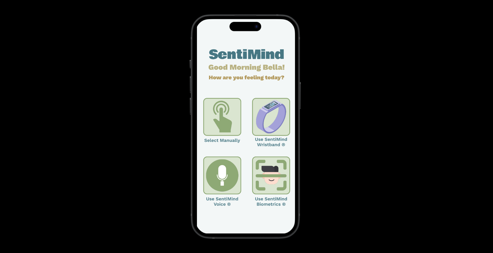
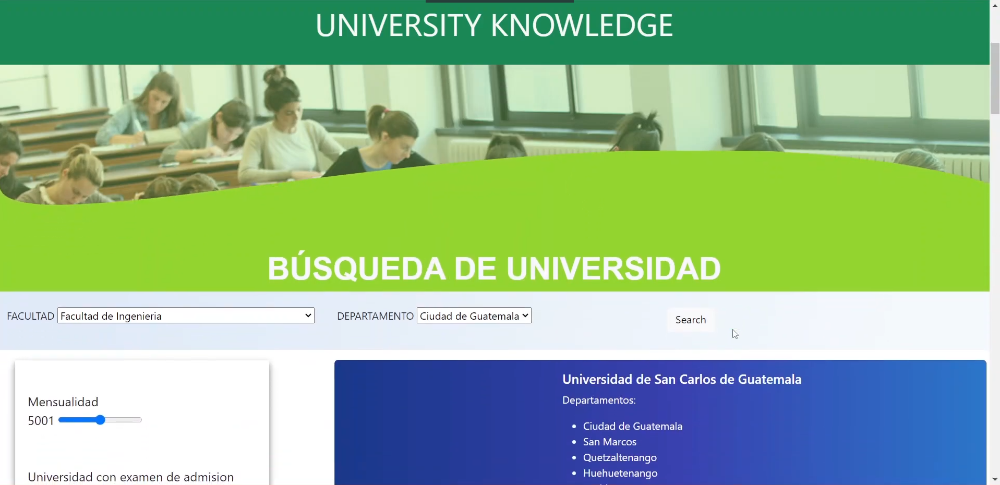
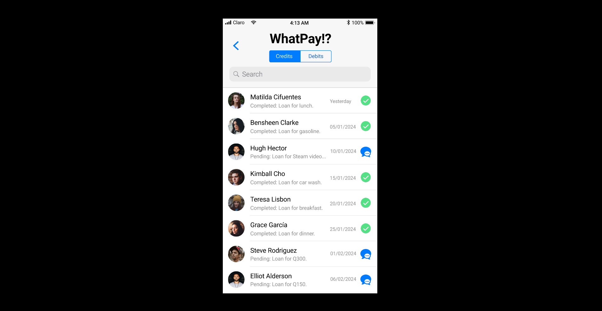

# 🌟 Personal Portfolio 🌟

Welcome to my personal portfolio! This project showcases some of my work, skills and experience in web development and UI/UX design.

# You can see my portfolio [here!](https://portfolio-xavier-lopez.netlify.app/)

## 📂 Project Structure

```bash
.
├── LICENSE
├── README.md
├── components
│   ├── Avatar.js
│   ├── Bulb.js
│   ├── CardLeft.js
│   ├── CardRight.js
│   ├── Circles.js
│   ├── Header.js
│   ├── Layout.js
│   ├── Nav.js
│   ├── ParticlesContainer.js
│   ├── ProjectsBtn.js
│   ├── ServiceSlider.js
│   ├── Socials.js
│   ├── TopLeftImg.js
│   ├── Transition.js
│   └── WorkSlider.js
├── next.config.js
├── package-lock.json
├── package.json
├── pages
│   ├── _app.js
│   ├── about
│   │   └── index.js
│   ├── api
│   │   └── hello.js
│   ├── contact
│   │   └── index.js
│   ├── index.js
│   ├── services
│   │   └── index.js
│   └── work
│       └── index.js
├── postcss.config.js
├── public
│   ├── Calculator with Testing.png
│   ├── Fashion Frame Blog.png
│   ├── Live Chat.png
│   ├── SentiMind.png
│   ├── Steam for Moms.png
│   ├── The Cozy Whiskers.png
│   ├── TikTok Zenith.png
│   ├── UniversityKnowledge.png
│   ├── Warframe Blog.png
│   ├── Whatpay.png
│   ├── avatar.png
│   ├── bg-explosion.png
│   ├── bulb.png
│   ├── circle-star.svg
│   ├── circles.png
│   ├── logo.svg
│   ├── rounded-text.png
│   ├── site-bg.svg
│   └── top-left-img.png
├── styles
│   └── globals.css
├── tailwind.config.js
├── variants.js
└── vercel.json
```

# 🚀 Technologies Used.

- Next.js - React framework for web applications.
- React - JavaScript library for building user interfaces.
- Tailwind CSS - CSS framework for fast and responsive design.
- Framer Motion - Library for React animations.
- CountUp.js - React component for counting animations.

## 📸 Project Screenshots

## Calculator with Testing


## Fashion Frame Blog


## Live Chat (JS only)


## SentiMind


## Steam for Moms


## The Cozy Whiskers


## TikTok Zenith


## University Knowledge


## Warframe Blog


## Whatpay!?



## 🛠️ Installation and Configuration

Clone the repository:

```bash
  git clone https://github.com/XavierLopez25/portfolio_v1.git
  cd portfolio_v1
```

Install dependencies:

```bash
  npm install
```

Run the development server:

```bash
  npm run dev
```

Build the application for production:

```bash
  npm run build
```

Run the application in production mode:

```bash
  npm start
```

# 📄 License
This project is licensed under the MIT License. See the LICENSE file for more details.

# 📧 Contact
If you have any questions or suggestions, feel free to contact me through my email.

Thanks for visiting my portfolio! 🚀
